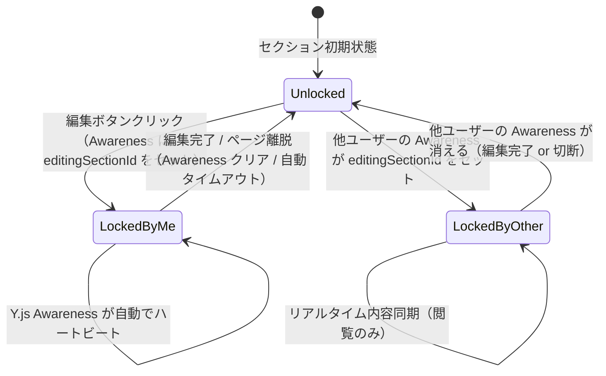
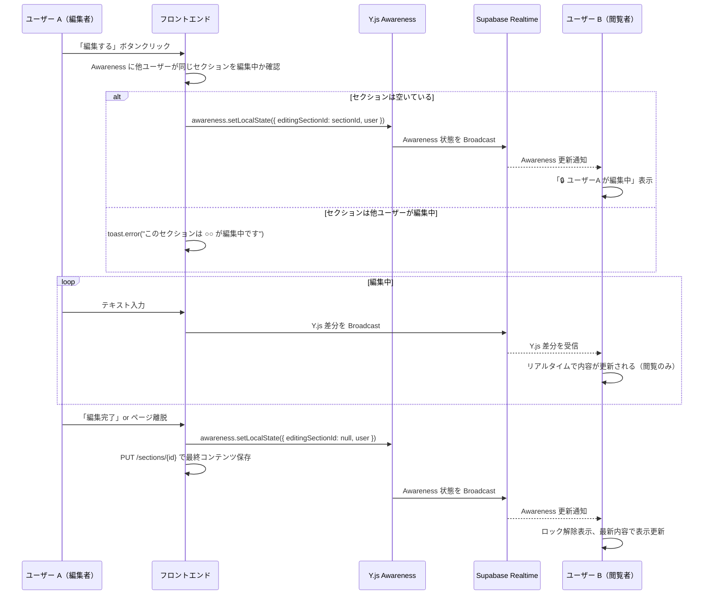
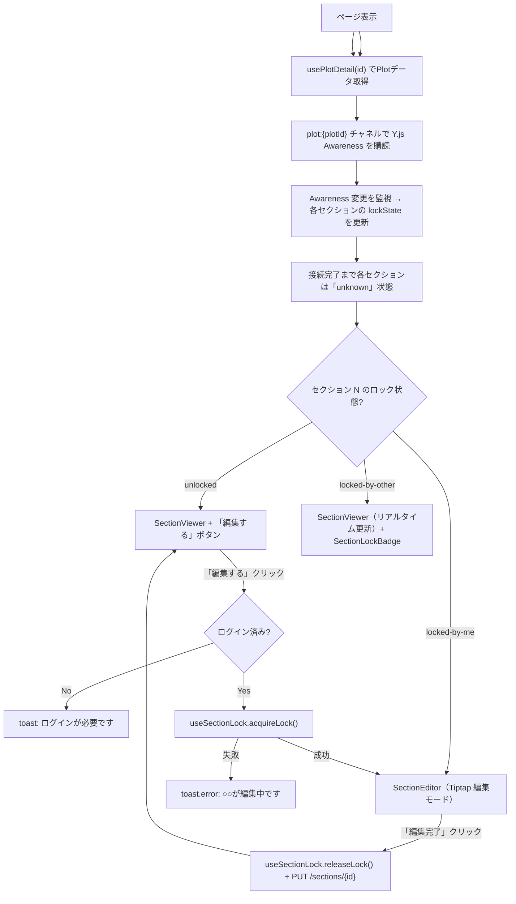

# セクション単位編集 + リアルタイム同期 仕様書

> **ステータス:** 確定仕様
> **最終更新:** 2026-02-19

---

## 概要

Plot（記事）の編集は**セクション単位**で行われる。1 つのセクションを同時に編集できるのは **1 人だけ**（排他ロック）。他のユーザーはロック中のセクションを編集できないが、**編集中の内容はリアルタイムで同期され、閲覧することは可能**。

### 仕様の 3 本柱

| 項目 | 内容 |
|------|------|
| **セクション単位編集** | Plot 全体ではなく、セクション（見出し＋本文のまとまり）ごとに個別に編集できる |
| **排他ロック** | 誰かが編集中のセクションは他のユーザーが編集開始できない。「🔒 {ユーザー名} が編集中」と表示される |
| **リアルタイム同期** | 編集中のテキスト変更がリアルタイムで他の閲覧者に反映される（読み取り専用として表示） |

---

## 技術アーキテクチャ

### 使用技術

| レイヤー | 技術 | 用途 |
|---------|------|------|
| **エディタ** | Tiptap + ProseMirror | リッチテキスト編集 |
| **CRDT + ロック管理** | Y.js + y-prosemirror + **Y.js Awareness** | 編集内容のリアルタイム同期 + **セクションロック状態の共有** |
| **通信** | Supabase Realtime (WebSocket) | Y.js の同期トランスポート + Awareness 状態配信 |
| **バックエンド永続化** | REST API (FastAPI) | セクション内容の保存（`PUT /sections/{id}`） |

> [!IMPORTANT]
> **ロック管理に REST API は使わない。** Y.js の Awareness プロトコルがロック状態の共有・タイムアウト・切断時の自動解放をすべて担う。バックエンドにロック用エンドポイントは不要。

### 通信レイヤー図

```
┌─────────────────────────────────────────────────────────────┐
│  ブラウザ                                                     │
│                                                               │
│  ┌──────────────┐    ┌──────────────┐   ┌─────────────────┐ │
│  │ TiptapEditor │◄──►│ Y.js Doc     │──►│ y-prosemirror   │ │
│  └──────────────┘    └──────┬───────┘   └─────────────────┘ │
│                             │                                 │
│                    ┌────────▼────────┐                       │
│                    │ Y.js Awareness  │  ← ロック状態管理      │
│                    │ (誰がどのセクシ  │                       │
│                    │  ョンを編集中か) │                       │
│                    └────────┬────────┘                       │
│                             │                                 │
│                    ┌────────▼────────┐                       │
│                    │ Supabase        │                       │
│                    │ Realtime Client │                       │
│                    └────────┬────────┘                       │
├─────────────────────────────┼───────────────────────────────┤
│  ネットワーク               │ WebSocket                      │
├─────────────────────────────┼───────────────────────────────┤
│  Supabase Server            │                                │
│                    ┌────────▼────────┐                       │
│                    │ Realtime Server │                       │
│                    │  - Broadcast    │   ← Y.js 差分配信     │
│                    │  - Presence     │   ← Awareness 状態    │
│                    └─────────────────┘                       │
├─────────────────────────────────────────────────────────────┤
│  FastAPI                                                      │
│  ┌──────────┐ ┌──────────────────────────┐                  │
│  │ Sections │ │ History (操作ログ/SS)     │                  │
│  │ CRUD     │ │ hot_operations /          │                  │
│  │          │ │ cold_snapshots            │                  │
│  └──────────┘ └──────────────────────────┘                  │
└─────────────────────────────────────────────────────────────┘
```

---

## ロック管理: Y.js Awareness

### なぜ Y.js Awareness？

| 項目 | REST API ロック | Y.js Awareness |
|------|----------------|---------------|
| バックエンド作業 | エンドポイント3つ必要 | **不要** |
| ハートビート | 自前実装 | **Y.js 内蔵**（デフォルト30秒） |
| 切断時の解放 | sendBeacon + サーバータイムアウト | **自動**（Awareness が消える） |
| 実装量 | フロント＋バック両方 | **フロントのみ** |

### Awareness 状態の定義

```typescript
// lib/realtime/types.ts
interface SectionAwarenessState {
  /** 現在のユーザー情報 */
  user: {
    id: string;
    displayName: string;
    avatarUrl: string | null;
  };
  /** ユーザーが編集中のセクションID（null = 閲覧のみ） */
  editingSectionId: string | null;
}
```

### ロックのライフサイクル



### ロック取得〜解放フロー



### タイムアウト（自動）

- Y.js Awareness のデフォルトタイムアウト: **30 秒**
- ユーザーが切断した場合、30 秒後に他クライアントの Awareness から自動的に削除される
- **追加実装は不要** — Y.js が内蔵のハートビートとタイムアウトを処理する

### 接続初期のステータス
Awareness に接続するまでの間、ロック状態は不明となる。

- **初期状態:** `lockState = "unknown"` (または `loading`)
- **UI 表示:** 「⏳ 接続中...」等のインジケータ、または編集ボタンを非活性化
- **接続完了:** Awareness の同期が完了した時点で `lockState` が `unlocked` / `locked-by-other` に確定する

---

## Supabase Realtime チャネル設計

### チャネル命名規則

| チャネル名 | 用途 | 機能 |
|-----------|------|------|
| `plot:{plotId}` | Plot 全体の通信 | Y.js 差分の Broadcast + Awareness（ロック状態共有） |

> **チャネルは Plot 単位で 1 つだけ。** セクション単位のチャネルは不要。Y.js Doc は Plot 全体で 1 つ共有し、Awareness の `editingSectionId` で「どのセクションを誰が編集しているか」を管理する。

### Broadcast ペイロード

```typescript
// Y.js の更新差分を配信
interface YjsSyncMessage {
  type: "yjs-update";
  /** Y.js の更新バイナリを Base64 エンコードしたもの */
  update: string;
  /** 送信者のユーザーID（自分のメッセージを無視するため） */
  senderId: string;
}
```

---

## フロントエンド実装ガイド

### ファイル構成

```
src/
├── lib/
│   └── realtime/                     # Supabase Realtime + Y.js ラッパー
│       ├── channel.ts               #   チャネル作成・管理ユーティリティ
│       ├── awareness.ts             #   Y.js Awareness ラッパー (ロック状態管理)
│       └── types.ts                 #   SectionAwarenessState, YjsSyncMessage 等
│
├── hooks/
│   ├── useSectionLock.ts            #   セクションロック管理 (Y.js Awareness ベース)
│   └── useRealtimeSection.ts        #   セクション内容リアルタイム同期
│
└── components/
    └── section/
        ├── SectionEditor/
        │   ├── SectionEditor.tsx    #   編集コンポーネント（ロック統合）
        │   └── SectionEditor.module.scss
        ├── SectionViewer/
        │   ├── SectionViewer.tsx    #   閲覧コンポーネント（リアルタイム更新対応）
        │   └── SectionViewer.module.scss
        └── SectionLockBadge/
            ├── SectionLockBadge.tsx #   「🔒 ○○が編集中」バッジ
            └── SectionLockBadge.module.scss
```

### Hook 詳細仕様

#### `useSectionLock(sectionId: string)`

Y.js Awareness ベースでセクションのロック状態を管理するカスタム Hook。

```typescript
interface UseSectionLockReturn {
  /** ロック状態（unknown = 接続前） */
  lockState: "unknown" | "unlocked" | "locked-by-me" | "locked-by-other";
  /** ロック保持者の情報（自分以外がロック中の場合） */
  lockedBy: { id: string; displayName: string; avatarUrl: string | null } | null;
  /** ロック取得（Awareness に editingSectionId をセット） */
  acquireLock: () => boolean;
  /** ロック解放（Awareness の editingSectionId を null に） */
  releaseLock: () => void;
}
```

**内部動作:**
1. `acquireLock()` 呼び出し → Awareness 状態を確認 → 他ユーザーが同じセクションを編集中なら `false` を返す
2. 空いていれば `awareness.setLocalState({ editingSectionId: sectionId, user })` → `true` を返す
3. `releaseLock()` 呼び出し or `useEffect` のクリーンアップ → `awareness.setLocalState({ editingSectionId: null, user })`
4. 他ユーザーの Awareness 変更を `awareness.on("change")` で監視 → `lockState` を自動更新

#### `useRealtimeSection(sectionId: string, enabled: boolean)`

セクション内容のリアルタイム同期を管理するカスタム Hook。

```typescript
interface UseRealtimeSectionReturn {
  /** リアルタイムで更新されるコンテンツ（Tiptap JSON） */
  liveContent: Record<string, unknown> | null;
  /** 接続状態 */
  connectionStatus: "connecting" | "connected" | "disconnected";
}
```

**内部動作:**
1. `plot:{plotId}` Broadcast チャネルを購読
2. Y.js 差分メッセージを受信 → ローカルの Y.js Doc に適用 → Tiptap エディタに反映
3. 編集者側: `editor.on("update")` → Y.js 差分を Broadcast チャネルに送信

### コンポーネント詳細

#### `SectionEditor` — ロック統合版

```typescript
interface SectionEditorProps {
  section: SectionResponse;
  /** ロック状態（親から渡される） */
  lockState: "unknown" | "unlocked" | "locked-by-me" | "locked-by-other";
  /** ロック保持者情報 */
  lockedBy: { id: string; displayName: string; avatarUrl: string | null } | null;
  /** 保存コールバック */
  onSave: (title: string, content: Record<string, unknown>) => void;
  /** 編集開始コールバック（ロック取得をトリガー） */
  onEditStart: () => void;
  /** 編集終了コールバック（ロック解放をトリガー） */
  onEditEnd: () => void;
}
```

**「編集する」ボタンの動作:**
1. **未ログイン** → 編集をキャンセルし、ログインを促す（`toast` or ログインページへ誘導）
2. **ログイン済み + セクション空き** → そのまま **インプレース** で編集状態へ（ページ遷移なし）
3. **ログイン済み + 他ユーザーが編集中** → `toast.error("このセクションは ○○ が編集中です")`

**UI の状態遷移:**

| `lockState` | 表示 |
|-------------|------|
| `unknown` | 「⏳ 接続中...」or 非活性の編集ボタン |
| `unlocked` | 閲覧表示 + 「✏️ 編集する」ボタン |
| `locked-by-me` | Tiptap エディタ（編集可能）+ 「✅ 編集完了」ボタン |
| `locked-by-other` | 閲覧表示（リアルタイム更新）+ 「🔒 {ユーザー名} が編集中」バッジ |

> **インプレース編集**: `/plots/[id]/edit` への遷移は**行わない**。Plot 詳細ページ（`/plots/[id]`）上で直接セクションを編集する。

#### `SectionLockBadge`

```typescript
interface SectionLockBadgeProps {
  lockedBy: { id: string; displayName: string; avatarUrl: string | null };
  className?: string;
}
```

- `<Avatar>` (小) + `<Badge variant="secondary">🔒 {displayName} が編集中</Badge>`
- 背景色: 半透明の黄色（警告色）でロック状態を視覚的に示す
- パルスアニメーションで「リアルタイム編集中」を示唆

#### `SectionViewer` — リアルタイム更新版

```typescript
interface SectionViewerProps {
  section: SectionResponse;
  /** リアルタイム更新を有効にするか */
  enableRealtime?: boolean;
  /** 誰かが編集中かどうか */
  isBeingEdited?: boolean;
  /** 編集者情報 */
  editedBy?: { id: string; displayName: string; avatarUrl: string | null } | null;
}
```

- `enableRealtime === true` の場合:
  - `useRealtimeSection(section.id, true)` を内部で呼び出し
  - 受信した `liveContent` で Tiptap の content を更新（`editable: false` のまま）
  - セクション枠に微妙な青色のアウトラインを付与（リアルタイム更新中を示す）
- `isBeingEdited === true` の場合:
  - `SectionLockBadge` をセクション右上に表示

---

## エラーハンドリング

### ロック関連のエラーケース

| エラーケース | 原因 | フロントエンドの対処 |
|-------------|------|---------------------|
| **ロック取得失敗** | 他ユーザーが Awareness で同一セクションを編集中 | `toast.error("このセクションは ${displayName} が編集中です")` + 閲覧モード維持 |
| **編集中に他ユーザーが切断** | Awareness タイムアウト（30秒） | ロック自動解除。UI は自動更新 |
| **保存失敗 (403)** | Plot 一時停止 | `toast.error("このPlotは編集が一時停止されています")` |
| **WebSocket 切断** | ネットワーク障害 | 再接続を自動リトライ。失敗 → `toast.error("接続が切断されました")` + 閲覧モードに戻す |
| **未ログインで編集クリック** | 認証なし | `toast.error("編集するにはログインが必要です")` + ログインページへ誘導 |

---

## Plot 詳細ページ (`/plots/[id]`) での統合

### ページ全体のフロー



### 複数セクションの同時編集

- 1 ユーザーが同時に編集できるセクションは **1 つのみ**
- 別のセクションの「編集する」をクリック → 現在のセクションのロックを先に解放してから新しいロックを取得
- 異なるユーザーはそれぞれ **別のセクション** を同時に編集できる

### 初期ロック状態の取得
REST API にロック情報は持たず、**すべて Y.js Awareness の同期を待つ**。
ページ読み込み直後はロック状態が不明なため、UI 側でローディング表示（Skeleton や Disabled ボタン）を行う。Awareness が同期された瞬間に最新のロック状態が反映される。

---

## 使用する API（`docs/api.md` に定義済みのもののみ）

| API | 用途 |
|-----|------|
| `GET /plots/{plotId}` | Plot 詳細取得 |
| `PUT /sections/{sectionId}` | 編集完了時のセクション保存 |
| `POST /plots/{plotId}/sections` | セクション追加 |
| `DELETE /sections/{sectionId}` | セクション削除 |

> [!WARNING]
> ロック関連の REST API エンドポイントは**存在しない**。`POST /sections/{id}/lock` 等は使わないこと。ロック管理はすべて Y.js Awareness で行う。

---

## 注意事項・制約

> [!WARNING]
> - Y.js の CRDT 同期は **Supabase Realtime の Broadcast** を経由して行う。`y-websocket` サーバーは使わない（インフラコスト削減のため）
> - Supabase Realtime の Broadcast メッセージサイズ上限は **約 1MB**。大量テキストの一括変更は差分で送信するため通常は問題ないが、巨大な画像挿入時は REST API 経由で保存すること

> [!IMPORTANT]
> - ロック管理は **Y.js Awareness のみ**。REST API にロック用エンドポイントは存在しない
> - `PlotResponse.editingUsers` はフロントエンドのロック判定には使用しない（Awarenessを使用する）。初期ロック状態は Awareness 接続待ちとなる（「接続中...」表示）
> - PC でもモバイルでも編集可能（モバイル非表示の制限なし）

> [!TIP]
> - 開発初期（Mock モード）では `useSectionLock` をローカル state のみで管理し、`useRealtimeSection` は何もしない no-op にする。詳細は [09-mock-development.md](./09-mock-development.md) の「E.6 リアルタイム系 Hook の Mock」セクション参照
