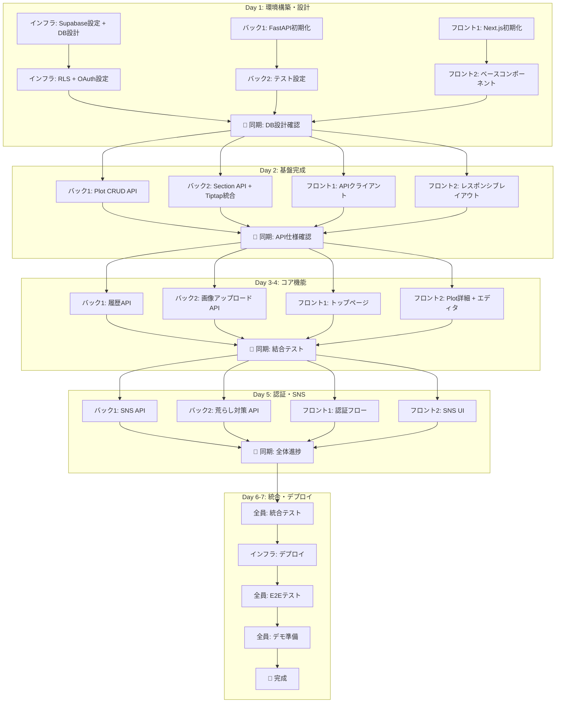
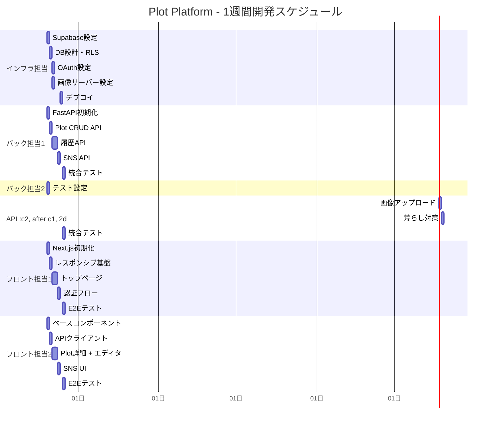

# Plot Platform - Wiki形式の共同編集プラットフォーム

## TL;DR

> **Quick Summary**: 「本当に欲しい」をカタチにするコミュニティ企画プラットフォーム。セクション単位のリアルタイム共同編集（Y.js）＋2層履歴保存＋SNS風Plot一覧を1週間で構築。
> 
> **Deliverables**:
> - Plot CRUD（企画書の作成・閲覧・更新・削除）
> - セクション単位のリアルタイム共同編集（Tiptap + Y.js + Supabase Realtime）
> - 2層履歴保存（ホット: 操作ログ / コールド: スナップショット）
> - SNS風トップページ（急上昇/新規/人気の3セクション）
> - タグ・検索・スター・フォーク・コメント機能
> - ユーザープロフィール・認証（GitHub + Google）
> - 荒らし対策（差分表示/復元/BAN/一時停止）
> - 画像アップロード（サーバーディレクトリ保存）
> - モバイル対応（閲覧モード必須）
> - APIドキュメント（OpenAPI/Swagger）
> 
> **Estimated Effort**: XL（1週間 × 5人 = 35人日）
> **Parallel Execution**: YES - 3 waves
> **Critical Path**: インフラ構築 → DB設計 → API実装 → フロント実装 → 統合テスト

---

## Context

### Original Request
ユーザーが作りたいプロダクトの企画書をwiki形式でオープンソースにして共同編集できるプラットフォームをハッカソンで作成。開発メンバーは5人（インフラ1、バック2、フロント2）、期間は1週間。バックエンドの技術構成を「凝った＋攻めたモノ」にしたい。

### API Specification
**詳細なAPIドキュメント**: [.sisyphus/plans/api-spec.md](./api-spec.md)
- 全28エンドポイント
- リクエスト/レスポンス形式
- 制限値・エラー形式

### Interview Summary
**Key Discussions**:
- **プロダクトコンセプト**: 「本当に欲しい」をカタチにするコミュニティ企画プラットフォーム
- **差別化ポイント**: オープンソース + 企画書特化 + リアルタイム共同編集 + 履歴の透明性
- **技術方針**: 1〜2個程度の新技術導入OK（Y.js + 2層ストレージ）
- **編集体験**: セクション単位で複数人同時編集、変更は即時確定（Wikipedia方式）
- **荒らし対策**: 差分可視化 + 1クリック復元 + BAN + 一時停止
- **公開範囲**: 全Plotは公開のみ（下書き/非公開なし）
- **フォーク**: 派生のみ（マージ提案なし）
- **検索**: Postgres全文検索
- **テスト戦略**: TDD

**Research Findings**:
- Y.js: CRDTベース、Next.js親和性高、リアルタイム編集のデファクト
- Supabase: Auth/PostgreSQL/Realtimeを一括提供、無料枠あり
- 2層ストレージ: CoreProtect（Minecraftプラグイン）方式を参考に設計

### Metis Review
**Identified Gaps** (addressed):
- **公開範囲の未定義**: → 公開のみに固定
- **フォークの範囲**: → 派生のみ（マージ提案除外）
- **荒らし対策の詳細**: → 基本対策 + BAN + 一時停止を必須化
- **MVPの肥大化リスク**: → 主導線を「Plot閲覧→編集→履歴/復元」に固定
- **リアルタイム技術リスク**: → 縮退案（非リアルタイム）を用意

---

## Work Objectives

### Core Objective
「本当に欲しい」をテーマに、コミュニティで企画書を共同編集・ブラッシュアップできるオープンソースプラットフォームを1週間で構築する。

### Concrete Deliverables
1. **Backend (FastAPI)**
   - Plot/Section CRUD API
   - ユーザー認証API（Supabase Auth連携）
   - 履歴API（Phase 1/Phase 2）
   - 検索API（Postgres全文検索）
   - SNS API（スター、フォーク、コメント、ランキング）

2. **Frontend (Next.js + Y.js)**
   - トップページ（急上昇/新規/人気のPlot一覧）
   - Plot詳細ページ（セクション編集、履歴表示）
   - ユーザープロフィールページ
   - 認証フロー（GitHub/Google OAuth）

3. **Infrastructure**
   - Supabaseプロジェクト設定
   - Docker構成（フロント/バック）
   - デプロイ（自宅サーバー or AWS）

### Definition of Done
- [ ] 全APIエンドポイントが動作し、curlで検証可能
- [ ] トップページでPlot一覧が表示される
- [ ] Plot詳細ページでリアルタイム編集が可能
- [ ] Plot全体ロールバックが可能
- [ ] GitHub/Google認証が動作する
- [ ] Docker compose upで全サービスが起動する

### Must Have
- Plot CRUD + セクション構造
- リアルタイム共同編集（Tiptap + Y.js）
- 履歴表示 + 復元
- SNS風トップページ（急上昇/新規/人気）
- ユーザー認証（GitHub + Google）
- スター・フォーク・コメント
- **モバイル対応（閲覧モード必須）**
- **画像アップロード**
- **APIドキュメント（OpenAPI/Swagger）**

### Must NOT Have (Guardrails)
- ❌ フォークのマージ提案機能
- ❌ 下書き/非公開/限定公開機能
- ❌ 高度なモデレーション（自動判定、機械学習）
- ❌ 通知機能
- ❌ オフライン編集
- ❌ モバイル編集モード（閲覧のみ）
- ❌ 外部検索基盤（Algolia等）
- ❌ GraphQL/Elixir（学習コスト高）

---

## Project Structure

```
2026_team20/
├── frontend/              # Next.js (React)
│   ├── app/               # App Router
│   ├── components/        # Reactコンポーネント
│   ├── hooks/             # カスタムフック
│   ├── lib/               # ユーティリティ
│   ├── public/            # 静的ファイル
│   └── e2e/               # E2Eテスト
├── backend/               # FastAPI
│   ├── app/
│   │   ├── routes/        # APIエンドポイント
│   │   ├── models/        # データモデル
│   │   ├── services/      # ビジネスロジック
│   │   └── tests/         # テスト
│   ├── docs/              # OpenAPI仕様
│   └── images/            # アップロード画像
├── supabase/              # Supabase設定
│   └── migrations/        # DBマイグレーション
├── docker-compose.yml
└── README.md
```

### API URL設計
- **ベースURL**: `domain.com/api/v1/*`
- **例**: `domain.com/api/v1/plots`, `domain.com/api/v1/sections`
- **理由**: CORS不要、構成シンプル

### 技術スタック（更新版）

| レイヤー | 技術 |
|---------|------|
| **フロントエンド** | Next.js 14+ (App Router) + Tiptap + **SCSS** |
| **リアルタイム編集** | Tiptap + Y.js + y-prosemirror |
| **バックエンド** | Python (FastAPI) |
| **認証** | Supabase Auth (GitHub + Google) |
| **DB** | Supabase PostgreSQL |
| **リアルタイム** | Supabase Realtime |
| **画像保存** | サーバーローカルディレクトリ（サニタイズ・リサイズ付き） |
| **APIドキュメント** | OpenAPI 3.0 (Swagger UI) |
| **スタイリング** | **SCSS**（Tailwindは使用しない） |
| **インフラ** | Docker/Podman（自宅サーバー or AWS） |

> ⚠️ **重要**: Tailwind CSSは使用しません。SCSSを使用します。

---

## 詳細仕様（確定値）

### データ制限

| 項目 | 制限値 |
|------|--------|
| Plotタイトル | 最大200文字 |
| Plot説明文 | 最大2000文字 |
| コメント本文 | 最大5000文字 |
| セクション数/Plot | 最大255個 |
| 画像ファイルサイズ | 最大5MB |
| 画像リサイズ | 最大幅1920px、アスペクト比維持、JPEG品質85 |
| 許可画像形式 | .jpg, .png, .gif, .webp |
| スナップショット最大サイズ | 10MB/スナップショット（超過時はスキップしてログ警告） |

### 表示件数

| 項目 | 件数 |
|------|------|
| トップページ（急上昇/新規/人気） | 各5件 |
| もっと見る | 最大100件 |
| 検索結果 | 20件/ページ |

### 履歴・ロールバック

| 項目 | 仕様 |
|------|------|
| HotOperation（操作ログ） | セクション単位、**72時間保持**（TTL超過分は自動削除）、UI表示用（「誰が、いつ、どこを、どう変えた」） |
| ColdSnapshot（スナップショット） | Plot全体、5分間隔バッチ作成（APScheduler）、**保持ポリシーに基づく段階的間引き**（直近7日=全保持、7〜30日=1時間1個、30日以降=1日1個）。毎日午前3時のcleanupバッチで間引きを実行。間引き後も各期間の最新スナップショットは必ず保持されるため、**実質的に無期限で復元ポイントが存在する**（ただし粒度は経過期間に応じて低下する） |
| ロールバック | Plot全体をスナップショットから復元（`POST /plots/{plotId}/rollback/{snapshotId}`） |
| ロールバック競合制御 | 楽観的ロック（`plots.version`）で同時ロールバックを排他制御。バージョン不一致時は409 Conflictを返却 |
| 荒らし対策 | BAN/一時停止で事前防止が基本方針、5分間隔のPlotスナップショットで復元可能 |

### ランキングアルゴリズム

| 項目 | 仕様 |
|------|------|
| 急上昇（Trending） | 直近72時間のスター増加数でソート |
| 人気（Popular） | 全期間のスター総数でソート |
| 新規（New） | 作成日時の降順 |

### コメント機能

| 項目 | 仕様 |
|------|------|
| 構造 | スレッド形式（各セクションに紐づく） |
| ネスト | なし（フラット） |
| 返信 | 「このメッセージに返信」機能あり（親メッセージIDを参照） |

### エディタ（Tiptap）

| 項目 | 仕様 |
|------|------|
| 文字色 | 8色の基本パレット |
| 基本機能 | 太字、斜体、下線、打消し、リンク、見出し、リスト |

### モバイル対応

| 項目 | 仕様 |
|------|------|
| 閲覧モード | レスポンシブ対応（1/2/3カラム切り替え） |
| 編集モード | PCのみ（モバイルでは非表示） |

### エラーレスポンス

| 項目 | 仕様 |
|------|------|
| 形式 | `{"detail": "エラーメッセージ"}`（FastAPI標準） |

---

## Team Workflow (Mermaid)

### 全体フロー



### 担当別タイムライン



### 同期ミーティングの目的

| タイミング | 目的 | 確認事項 |
|-----------|------|---------|
| **Day 1 終了時** | DB設計の認識合わせ | テーブル構造、RLS、APIエンドポイント案 |
| **Day 2 終了時** | API仕様の確定 | OpenAPI仕様書の共有、フロント実装開始 |
| **Day 4 終了時** | 結合テスト | CRUD + リアルタイム編集の動作確認 |
| **Day 5 終了時** | 全体進捗 | 残タスク確認、デプロイ準備 |

---

### Test Decision
- **Infrastructure exists**: YES（要セットアップ）
- **Automated tests**: TDD（RED-GREEN-REFACTOR）
- **Framework**: pytest（Backend）、Vitest/Jest（Frontend）

### Agent-Executed QA Scenarios (MANDATORY — ALL tasks)

**Backend (FastAPI)**:
```
Scenario: Health check returns ok
  Tool: Bash (curl)
  Steps:
    1. curl -sS http://localhost:8000/health
    2. Assert: response contains "ok" or {"status":"ok"}
  Expected Result: API is running
  Evidence: stdout captured

Scenario: Create plot returns UUID
  Tool: Bash (curl)
  Steps:
    1. curl -sS -X POST http://localhost:8000/api/plots \
         -H 'Content-Type: application/json' \
         -d '{"title":"Test Plot","tags":["test"],"visibility":"public"}'
    2. Assert: response.id is valid UUID
  Expected Result: Plot created with UUID
  Evidence: Response body captured

Scenario: Search plots returns results
  Tool: Bash (curl)
  Steps:
    1. curl -sS "http://localhost:8000/api/search?query=Test"
    2. Assert: response.items is array
    3. Assert: response.items.length >= 0
  Expected Result: Search returns JSON array
  Evidence: Response body captured
```

**Frontend (Next.js)**:
```
Scenario: Top page loads successfully
  Tool: Bash (curl)
  Steps:
    1. curl -sS -I http://localhost:3000 | head -n 1
    2. Assert: HTTP status is 200
  Expected Result: Frontend is running
  Evidence: HTTP headers captured

Scenario: Plot page displays content
  Tool: Playwright (playwright skill)
  Preconditions: Dev server running, test plot exists
  Steps:
    1. Navigate to: http://localhost:3000/plots/{test_plot_id}
    2. Wait for: h1 visible (timeout: 5s)
    3. Assert: h1 contains plot title
    4. Screenshot: .sisyphus/evidence/plot-page.png
  Expected Result: Plot page renders correctly
  Evidence: .sisyphus/evidence/plot-page.png
```

---

## Execution Strategy

### Parallel Execution Waves

```
Wave 1 (Day 1-2): 基盤構築
├── Task 1: Supabase設定 + DB設計
├── Task 2: FastAPI プロジェクト初期化 + OpenAPI設定
└── Task 3: Next.js プロジェクト初期化 + Tiptap設定

Wave 2 (Day 3-5): コア機能実装
├── Task 4: Plot CRUD API
├── Task 5: Section API + Tiptap + Y.js統合
├── Task 6: 履歴API（2層ストレージ）
├── Task 7: 画像アップロード API
├── Task 8: フロント - トップページ（モバイル対応）
├── Task 9: フロント - Plot詳細ページ（Tiptapエディタ）
└── Task 10: 認証フロー

Wave 3 (Day 6-7): SNS機能 + 統合
├── Task 11: SNS API（スター/フォーク/コメント/ランキング）
├── Task 12: フロント - SNS機能
├── Task 13: 荒らし対策（BAN/一時停止）
├── Task 14: ユーザープロフィール
└── Task 15: 統合テスト + デプロイ
```

### Dependency Matrix

| Task | Depends On | Blocks | Can Parallelize With |
|------|------------|--------|---------------------|
| 1 | None | 4, 5, 6, 11 | 2, 3 |
| 2 | None | 4, 5, 6, 7 | 1, 3 |
| 3 | None | 8, 9, 10, 12, 14 | 1, 2 |
| 4 | 1, 2 | 8 | 5, 6, 7 |
| 5 | 1, 2 | 9 | 4, 6, 7 |
| 6 | 1, 2 | 9 | 4, 5, 7 |
| 7 | 2 | 9 | 4, 5, 6 |
| 8 | 3, 4 | None | 9, 10, 11 |
| 9 | 3, 5, 6, 7 | None | 8, 10, 11 |
| 10 | 3 | 14 | 8, 9, 11 |
| 11 | 1, 2 | 12 | 8, 9, 10 |
| 12 | 3, 11 | None | 13, 14, 15 |
| 13 | 1, 2 | None | 12, 14, 15 |
| 14 | 3, 10 | None | 12, 13, 15 |
| 15 | All | None | None (final) |

### Agent Dispatch Summary

| Wave | Tasks | Recommended Agents |
|------|-------|-------------------|
| 1 | 1, 2, 3 | インフラ1 + バック2 + フロント2（各自担当） |
| 2 | 4, 5, 6, 7, 8, 9 | バック2（API） + フロント2（UI） |
| 3 | 10, 11, 12, 13, 14 | 全員（機能完成＋統合） |

---

## TODOs

- [ ] 1. Supabase設定 + DB設計（インフラ担当）

  **What to do**:
  - Supabaseプロジェクト作成
  - PostgreSQLスキーマ設計・マイグレーション作成
  - RLS（Row Level Security）ポリシー設定
  - Auth Provider設定（GitHub + Google OAuth）

  **Must NOT do**:
  - 複雑なRLSポリシー（MVPは「公開読み取り/編集はログインのみ」）
  - トリガー/ストアドプロシージャの過剰実装

  **Recommended Agent Profile**:
  - **Category**: `unspecified-high`
  - **Skills**: []
  - Reason: インフラ設定は専門知識が必要だが、Supabaseはマネージドサービスなので学習コスト低

  **Parallelization**:
  - **Can Run In Parallel**: YES
  - **Parallel Group**: Wave 1 (with Tasks 2, 3)
  - **Blocks**: 4, 5, 6, 11
  - **Blocked By**: None

  **References**:
  - `https://supabase.com/docs/guides/database` - PostgreSQL設定
  - `https://supabase.com/docs/guides/auth` - 認証設定
  - `https://supabase.com/docs/guides/realtime` - Realtime設定

  **Acceptance Criteria**:
  - [ ] Supabaseプロジェクトが作成されている
  - [ ] 以下のテーブルが作成されている（制限値を反映）:
    - `users` (id, email, display_name, avatar_url, created_at)
    - `plots` (id, title VARCHAR(200), description VARCHAR(2000), owner_id, tags, visibility, version INTEGER DEFAULT 0, thumbnail_url TEXT DEFAULT NULL, created_at, updated_at)
      - version: 楽観的ロック用。ロールバック時にバージョンチェックを行い、同時ロールバックの競合を防止
    - `sections` (id, plot_id, title, content, order_index, version INTEGER DEFAULT 1, created_at, updated_at)
      - plot_idに外部キー制約
      - version: セクションの編集バージョン。更新ごとにインクリメントされ、差分取得・スナップショット記録に使用
    - `hot_operations` (id, section_id, operation_type, payload, user_id, version INTEGER NOT NULL, created_at)
      - TTL: 72時間（操作ログ表示用）
      - version: 操作時点のセクションバージョンを記録。履歴一覧や差分取得で使用
    - `cold_snapshots` (id, plot_id, content, version, created_at)
      - Plot全体のJSONスナップショット、5分間隔バッチ作成
      - 保持ポリシー: 直近7日=全保持、7〜30日=1時間1個、30日以降=1日1個（毎日午前3時にcleanupバッチで間引き）
      - plot_idに外部キー制約（`ON DELETE CASCADE`）: Plot削除時に関連スナップショットを自動削除
    - `stars` (id, plot_id, user_id, created_at)
    - `forks` (id, source_plot_id, new_plot_id, user_id, created_at)
    - `threads` (id, plot_id, section_id (NULL許可), created_at)
      - section_id: ロールバック時にセクションIDが新規採番されるため、NULL許容。NULLの場合はPlot単位のスレッドとして扱う
    - `comments` (id, thread_id, user_id, content, created_at)
    - `plot_bans` (id, plot_id, user_id, reason, created_at)
    - `rollback_logs` (id, plot_id, snapshot_id, snapshot_version, user_id, reason, created_at)
      - ロールバック操作の監査ログ。「誰が、いつ、どのスナップショットに復元したか」を記録
      - `snapshot_version INTEGER NOT NULL`: ロールバック先スナップショットのバージョン番号。スナップショット間引き（`ON DELETE SET NULL`）後もバージョン情報を保持するため、非正規化して記録する
      - plot_id, snapshot_id, user_idに外部キー制約
      - plot_idは `ON DELETE CASCADE`: Plot削除時に関連ログを自動削除
      - snapshot_idは `ON DELETE SET NULL`: スナップショット間引き時もログは保持
  - [ ] GitHub/Google OAuth Providerが設定されている
  - [ ] RLSポリシーが設定されている（plots: 公開読み取り, sections: 公開読み取り, 編集は要ログイン）

  **Agent-Executed QA Scenarios**:
  ```
  Scenario: Tables exist in Supabase
    Tool: Bash (psql via Supabase CLI)
    Steps:
      1. supabase db pull --schema public
      2. Assert: All required tables exist
    Expected Result: Schema matches design
    Evidence: Schema dump captured
  ```

  **Commit**: YES
  - Message: `chore(db): initial schema and RLS policies`
  - Files: `supabase/migrations/*.sql`

---

- [ ] 2. FastAPI プロジェクト初期化 + OpenAPI設定（バック担当1）

  **What to do**:
  - FastAPI プロジェクト構造作成（`2026_team20/backend/`）
  - 依存関係インストール（fastapi, uvicorn, sqlalchemy, pydantic, supabase, python-multipart, Pillow）
  - OpenAPI/Swagger設定（FastAPI標準機能）
  - 環境変数設定（.env）
  - ベースモデル・ユーティリティ作成
  - テストフレームワーク設定（pytest）
  - `images/` ディレクトリ作成（画像保存用）

  **Must NOT do**:
  - 過剰な抽象化（レイヤードアーキテクチャ等）
  - 複雑なDIコンテナ設定

  **Recommended Agent Profile**:
  - **Category**: `quick`
  - **Skills**: []

  **Parallelization**:
  - **Can Run In Parallel**: YES
  - **Parallel Group**: Wave 1 (with Tasks 1, 3)
  - **Blocks**: 4, 5, 6, 7
  - **Blocked By**: None

  **References**:
  - `https://fastapi.tiangolo.com/tutorial/` - FastAPI チュートリアル
  - `https://fastapi.tiangolo.com/tutorial/metadata/` - OpenAPI メタデータ
  - `https://supabase.com/docs/reference/python` - Supabase Python Client

  **Acceptance Criteria**:
  - [ ] `2026_team20/backend/` にプロジェクトが作成されている
  - [ ] `docker compose up backend` でFastAPIが起動する
  - [ ] `curl http://localhost:8000/health` → `{"status":"ok"}`
  - [ ] `curl http://localhost:8000/docs` → Swagger UIが表示される
  - [ ] pytest が動作する（空テストでPASS）
  - [ ] .env.example が存在する
  - [ ] `2026_team20/backend/images/` ディレクトリが存在する

  **Agent-Executed QA Scenarios**:
  ```
  Scenario: FastAPI health check
    Tool: Bash (curl)
    Steps:
      1. docker compose up -d backend
      2. sleep 5
      3. curl -sS http://localhost:8000/health
      4. Assert: response contains "ok"
    Expected Result: API server running
    Evidence: stdout captured
  ```

  **Commit**: YES
  - Message: `chore(backend): initialize FastAPI project`
  - Files: `backend/`

---

- [ ] 3. Next.js プロジェクト初期化 + Tiptap設定（フロント担当）

  **What to do**:
  - Next.js 14+ (App Router) プロジェクト作成（`2026_team20/frontend/`）
  - 依存関係インストール:
    - `@tiptap/react`, `@tiptap/starter-kit`, `@tiptap/extension-color`, `@tiptap/extension-text-style`
    - `yjs`, `y-prosemirror`（Tiptap + Y.js連携）
    - `@supabase/auth-helpers-nextjs`, `@supabase/supabase-js`
    - `sass`（SCSS用）
  - **SCSS設定**（Tailwind CSSは使用しない）
  - ベースコンポーネント作成（Layout, Header, Footer - モバイル対応）
  - テストフレームワーク設定（Vitest）

  **Must NOT do**:
  - Tailwind CSSの導入（SCSSを使用）
  - 過剰なコンポーネント設計
  - 複雑な状態管理ライブラリ（Redux等）

  **Recommended Agent Profile**:
  - **Category**: `visual-engineering`
  - **Skills**: [`frontend-ui-ux`]

  **Parallelization**:
  - **Can Run In Parallel**: YES
  - **Parallel Group**: Wave 1 (with Tasks 1, 2)
  - **Blocks**: 8, 9, 10, 12, 14
  - **Blocked By**: None

  **References**:
  - `https://nextjs.org/docs/getting-started` - Next.js ドキュメント
  - `https://tiptap.dev/` - Tiptap ドキュメント
  - `https://tiptap.dev/api/extensions/color` - Tiptap Color Extension

  **Acceptance Criteria**:
  - [ ] `2026_team20/frontend/` にプロジェクトが作成されている
  - [ ] `docker compose up frontend` でNext.jsが起動する
  - [ ] `curl -I http://localhost:3000` → HTTP 200
  - [ ] SCSSが動作する（スタイル適用確認）
  - [ ] Tiptapがimport可能
  - [ ] vitest が動作する（空テストでPASS）

  **Agent-Executed QA Scenarios**:
  ```
  Scenario: Next.js top page loads
    Tool: Bash (curl)
    Steps:
      1. docker compose up -d frontend
      2. sleep 10
      3. curl -sS -I http://localhost:3000 | head -n 1
      4. Assert: HTTP status is 200
    Expected Result: Frontend server running
    Evidence: HTTP headers captured
  ```

  **Commit**: YES
  - Message: `chore(frontend): initialize Next.js project`
  - Files: `frontend/`

---

- [ ] 4. Plot CRUD API（バック担当1）

  **What to do**:
  - Plot作成・取得・更新・削除API
  - バリデーション:
    - タイトル: 最大200文字
    - 説明文: 最大2000文字
  - タグ付きPlot作成対応
  - テスト作成（TDD: RED→GREEN）

  **TDD Flow**:
  1. RED: テスト作成（期待するAPIレスポンスを定義）
  2. GREEN: 最小限の実装でテストを通す
  3. REFACTOR: コード整理

  **Must NOT do**:
  - 過剰なバリデーション（MVPは最低限）
  - 複雑なクエリ最適化

  **Recommended Agent Profile**:
  - **Category**: `unspecified-high`
  - **Skills**: []

  **Parallelization**:
  - **Can Run In Parallel**: YES
  - **Parallel Group**: Wave 2 (with Tasks 5, 6)
  - **Blocks**: 7
  - **Blocked By**: 1, 2

  **References**:
  - `backend/models/plot.py` - Plotモデル（Task 2で作成）
  - `supabase/migrations/001_initial.sql` - DBスキーマ（Task 1で作成）

  **Acceptance Criteria**:
  - [ ] POST /api/v1/plots → Plot作成、UUID返却
  - [ ] GET /api/v1/plots/{id} → Plot取得
  - [ ] PUT /api/v1/plots/{id} → Plot更新
  - [ ] DELETE /api/v1/plots/{id} → Plot削除
  - [ ] pytest tests/test_plots.py → PASS

  **Agent-Executed QA Scenarios**:
  ```
  Scenario: Create and retrieve plot
    Tool: Bash (curl)
    Steps:
      1. curl -sS -X POST http://localhost:8000/api/v1/plots \
           -H 'Content-Type: application/json' \
           -d '{"title":"Test","tags":["hack"],"visibility":"public"}'
      2. Assert: response.id is UUID
      3. GET /api/v1/plots/{id}
      4. Assert: response.title == "Test"
    Expected Result: Plot CRUD works
    Evidence: Response bodies captured
  ```

  **Commit**: YES
  - Message: `feat(api): add Plot CRUD endpoints`
  - Files: `backend/routes/plots.py`, `backend/tests/test_plots.py`

---

- [ ] 5. Section API + Tiptap + Y.js統合（バック担当2）

  **What to do**:
  - Section CRUD API
  - Tiptap JSON形式でのコンテンツ保存
  - Y.js ドキュメント永続化（Supabase連携）
  - リアルタイム同期の基盤（Supabase Realtime）
  - **Section CRUD時に親Plotの `updated_at` を更新する**（5分間隔バッチのスナップショット作成に必須）
  - テスト作成（TDD）

  **Must NOT do**:
  - オフライン対応
  - 複雑なCRDT設定

  **Recommended Agent Profile**:
  - **Category**: `ultrabrain`
  - **Skills**: []

  **Parallelization**:
  - **Can Run In Parallel**: YES
  - **Parallel Group**: Wave 2 (with Tasks 4, 6)
  - **Blocks**: 9
  - **Blocked By**: 1, 2

  **References**:
  - `https://tiptap.dev/guide/output` - Tiptap JSON output
  - `https://tiptap.dev/api/extensions/collaboration` - Tiptap Collaboration (Y.js)
  - `https://supabase.com/docs/guides/realtime` - Supabase Realtime

  **Acceptance Criteria**:
  - [ ] POST /api/v1/plots/{plot_id}/sections → Section作成
  - [ ] GET /api/v1/sections/{id} → Section取得（Tiptap JSON形式）
  - [ ] PUT /api/v1/sections/{id} → Section更新（Tiptap JSON）
  - [ ] DELETE /api/v1/sections/{id} → Section削除
  - [ ] pytest tests/test_sections.py → PASS

  **Agent-Executed QA Scenarios**:
  ```
  Scenario: Create section and sync
    Tool: Bash (curl)
    Steps:
      1. POST /api/plots/{plot_id}/sections \
           -d '{"title":"Background","content":"Initial content"}'
      2. Assert: response.id is UUID
      3. GET /api/sections/{id}
      4. Assert: response.content == "Initial content"
    Expected Result: Section CRUD works
    Evidence: Response bodies captured
  ```

  **Commit**: YES
  - Message: `feat(api): add Section CRUD with Y.js integration`
  - Files: `backend/routes/sections.py`, `backend/services/yjs_service.py`

---

- [ ] 6. 履歴API（2層ストレージ）（バック担当1）

  **What to do**:
  - HotOperation: 操作ログ保存API（**72時間保持、UI表示用**）
  - ColdSnapshot: 5分間隔バッチによるPlot全体スナップショット作成（**APScheduler、保持ポリシーに基づく段階的間引き: 直近7日=全保持、7〜30日=1時間1個、30日以降=1日1個**）
  - Plot全体ロールバックAPI（スナップショットからPlot全体を復元）
  - スナップショット一覧取得API
  - TTL cleanupジョブ（72時間経過したHotOperationを削除）
  - テスト作成（TDD）
  
  **注意**: 
  - 荒らし対策はBAN/一時停止で事前防止する方針。ロールバックはPlot全体単位のみ。
  - セクション単位のロールバックは行わない（設計変更済み、詳細は `.sisyphus/plans/renew-api.md` 参照）。
  - **重要**: Section CRUD時に `Plot.updated_at` が更新されていることが前提。Task 5で実装すること。

  **Must NOT do**:
  - セクション単位のロールバック（廃止済み）
  - 完全なイベントリプレイ（MVPはスナップショットベース）
  - 複雑な差分アルゴリズム
  - Phase 1ログの72時間以上の保持（DB容量対策）

  **Recommended Agent Profile**:
  - **Category**: `ultrabrain`
  - **Skills**: []

  **Parallelization**:
  - **Can Run In Parallel**: YES
  - **Parallel Group**: Wave 2 (with Tasks 4, 5)
  - **Blocks**: 8
  - **Blocked By**: 1, 2

  **References**:
  - `supabase/migrations/001_initial.sql` - hot_operations, cold_snapshots テーブル

  **Acceptance Criteria**:
  - [ ] POST /api/v1/sections/{id}/operations → 操作ログ保存
  - [ ] GET /api/v1/sections/{id}/history → 履歴一覧取得（72時間操作ログ）
  - [ ] GET /api/v1/plots/{id}/snapshots → スナップショット一覧取得
  - [ ] POST /api/v1/plots/{id}/rollback/{snapshotId} → Plot全体ロールバック
  - [ ] GET /api/v1/sections/{id}/diff/{from}/{to} → 差分取得
  - [ ] 5分間隔バッチでColdSnapshotが自動作成される
  - [ ] pytest tests/test_history.py → PASS

  **Agent-Executed QA Scenarios**:
  ```
  Scenario: Snapshot creation and plot rollback
    Tool: Bash (curl)
    Steps:
      1. Create plot with section, content "v1"
      2. Update section content to "v2"
      3. Wait for snapshot batch (or trigger manually)
      4. GET /api/v1/plots/{id}/snapshots
      5. Assert: snapshots.items.length >= 1
      6. POST /api/v1/plots/{id}/rollback/{snapshot_id}
      7. GET /api/v1/plots/{id}
      8. Assert: section content matches snapshot state
    Expected Result: Plot-level snapshot and rollback work
    Evidence: Response bodies captured
  ```

  **Commit**: YES
  - Message: `feat(api): add 2-layer history storage`
  - Files: `backend/routes/history.py`, `backend/services/history_service.py`

---

- [ ] 7. 画像アップロード API（バック担当2）

  **What to do**:
  - 画像アップロードAPI（POST /api/v1/images）
  - サーバーローカルディレクトリへの保存（`backend/images/`）
  - サニタイズ処理（ファイル名、拡張子チェック）
  - リサイズ処理（Pillow使用、**最大幅1920px、アスペクト比維持、JPEG品質85**）
  - ファイルサイズチェック（**最大5MB**）
  - 画像提供API（GET /api/v1/images/{filename}）
  - テスト作成（TDD）

  **Must NOT do**:
  - S3/クラウドストレージ連携
  - 複雑な画像処理（クロップ、フィルタ等）

  **Recommended Agent Profile**:
  - **Category**: `unspecified-high`
  - **Skills**: []

  **Parallelization**:
  - **Can Run In Parallel**: YES
  - **Parallel Group**: Wave 2 (with Tasks 4, 5, 6)
  - **Blocks**: 9
  - **Blocked By**: 2

  **References**:
  - `https://pillow.readthedocs.io/` - Pillow ドキュメント
  - `https://fastapi.tiangolo.com/tutorial/request-files/` - FastAPI File Upload

  **Acceptance Criteria**:
  - [ ] POST /api/v1/images → 画像アップロード、URL返却
  - [ ] GET /api/v1/images/{filename} → 画像配信
  - [ ] アップロード時にリサイズされる（最大幅1920px、アスペクト比維持）
  - [ ] 5MB超過のファイルは拒否される
  - [ ] 許可されない拡張子は拒否される（.jpg, .png, .gif, .webpのみ）
  - [ ] pytest tests/test_images.py → PASS

  **Agent-Executed QA Scenarios**:
  ```
  Scenario: Upload and retrieve image
    Tool: Bash (curl)
    Steps:
      1. curl -sS -X POST http://localhost:8000/api/v1/images \
           -F "file=@test_image.jpg"
      2. Assert: response.url contains "/api/v1/images/"
      3. GET {response.url}
      4. Assert: Content-Type starts with "image/"
    Expected Result: Image upload works
    Evidence: Response bodies captured
  ```

  **Commit**: YES
  - Message: `feat(api): add image upload with sanitization and resize`
  - Files: `backend/routes/images.py`, `backend/services/image_service.py`

---

- [ ] 8. フロント - トップページ（モバイル対応）（フロント担当1）

  **What to do**:
  - 急上昇（Trending）セクション - **5件表示**
  - 新規（New）セクション - **5件表示**
  - 人気（Popular）セクション - **5件表示**
  - 「もっと見る」ボタン - 最大100件まで表示
  - Plotカードコンポーネント（タイトル、タグ、スター数、更新時間）
    - ※「編集中のユーザー表示」はAPIレスポンスには含めず、Y.jsのawareness機能でクライアントサイドのみで管理する
  - **モバイル対応（SCSSで1/2/3カラム切り替え）**
  - テスト作成（Vitest + Playwright）

  **Must NOT do**:
  - 無限スクロール（MVPは固定表示）
  - 複雑なアニメーション

  **Recommended Agent Profile**:
  - **Category**: `visual-engineering`
  - **Skills**: [`frontend-ui-ux`]

  **Parallelization**:
  - **Can Run In Parallel**: YES
  - **Parallel Group**: Wave 2 (with Tasks 9, 10)
  - **Blocks**: None
  - **Blocked By**: 3, 4

  **References**:
  - `https://nextjs.org/docs/app/building-your-application/routing` - Next.js Routing
  - `frontend/components/` - 既存コンポーネント（Task 3で作成）

  **Acceptance Criteria**:
  - [ ] / にアクセスすると3セクションが表示される
  - [ ] 各Plotカードに情報が表示される
  - [ ] 編集中のPlotに「編集中」バッジが表示される（Y.js awarenessによるクライアントサイド管理）
  - [ ] **モバイル表示で1カラム、タブレットで2カラム、PCで3カラム**
  - [ ] vitest run → PASS
  - [ ] playwright test → PASS

  **Agent-Executed QA Scenarios**:
  ```
  Scenario: Top page displays plot list
    Tool: Playwright (playwright skill)
    Preconditions: Backend running, test plots exist
    Steps:
      1. Navigate to: http://localhost:3000
      2. Wait for: [data-testid="plot-card"] visible (timeout: 5s)
      3. Assert: At least 1 plot card exists
      4. Screenshot: .sisyphus/evidence/top-page.png
    Expected Result: Top page renders with plots
    Evidence: .sisyphus/evidence/top-page.png
  ```

  **Commit**: YES
  - Message: `feat(frontend): add top page with plot list`
  - Files: `frontend/app/page.tsx`, `frontend/components/PlotCard.tsx`

---

- [ ] 9. フロント - Plot詳細ページ + Tiptapエディタ（フロント担当2）

  **What to do**:
  - Plot詳細表示（タイトル、説明、タグ）
  - セクション一覧表示
  - **Tiptapエディタ統合（Y.js Collaboration拡張）**
  - 色変更ツールバー（TextStyle + Color拡張）
  - 画像挿入ボタン（アップロード → URL挿入）
  - 履歴サイドバー
  - 復元ボタン
  - **モバイル閲覧対応（編集はPCのみ）**
  - テスト作成（Playwright）

  **Must NOT do**:
  - カーソル共有表示
  - モバイル編集モード

  **Recommended Agent Profile**:
  - **Category**: `ultrabrain`
  - **Skills**: [`frontend-ui-ux`]

  **Parallelization**:
  - **Can Run In Parallel**: YES
  - **Parallel Group**: Wave 2 (with Tasks 8, 10)
  - **Blocks**: None
  - **Blocked By**: 3, 5, 6, 7

  **References**:
  - `https://tiptap.dev/api/extensions/collaboration` - Tiptap Collaboration
  - `https://tiptap.dev/api/extensions/color` - Tiptap Color Extension
  - `frontend/hooks/useYjs.ts` - Y.jsカスタムフック（Task 3で作成）

  **Acceptance Criteria**:
  - [ ] /plots/{id} にアクセスするとPlot詳細が表示される
  - [ ] Tiptapエディタでセクションを編集できる
  - [ ] 文字色を変更できる（**8色の基本パレット**から選択）
  - [ ] 画像を挿入できる（アップロード → エディタに挿入）
  - [ ] 履歴が表示される
  - [ ] 復元ボタンで前のバージョンに戻せる
  - [ ] **モバイルでは閲覧のみ（編集ボタン非表示）**
  - [ ] セクションは最大255個まで
  - [ ] playwright test → PASS

  **Agent-Executed QA Scenarios**:
  ```
  Scenario: Edit section and verify sync
    Tool: Playwright (playwright skill)
    Preconditions: Backend running, test plot with section exists
    Steps:
      1. Navigate to: http://localhost:3000/plots/{test_plot_id}
      2. Wait for: section editor visible (timeout: 5s)
      3. Click: section content area
      4. Type: "Hello World"
      5. Wait for: 2s (sync)
      6. Assert: Input contains "Hello World"
      7. Screenshot: .sisyphus/evidence/plot-edit.png
    Expected Result: Section editing works
    Evidence: .sisyphus/evidence/plot-edit.png
  ```

  **Commit**: YES
  - Message: `feat(frontend): add plot detail page with Tiptap editor`
  - Files: `frontend/app/plots/[id]/page.tsx`, `frontend/components/SectionEditor.tsx`

---

- [ ] 10. 認証フロー（フロント担当1 + インフラ）

  **What to do**:
  - Supabase Auth UIコンポーネント
  - ログインボタン（GitHub/Google）
  - セッション管理
  - 保護されたルート
  - ログアウト機能
  - テスト作成（Playwright）

  **Must NOT do**:
  - メール/パスワード認証（OAuthのみ）
  - パスワードリセットフロー（MVP省略）

  **Recommended Agent Profile**:
  - **Category**: `unspecified-high`
  - **Skills**: []

  **Parallelization**:
  - **Can Run In Parallel**: YES
  - **Parallel Group**: Wave 2 (with Tasks 8, 9, 11)
  - **Blocks**: 14
  - **Blocked By**: 3

  **References**:
  - `https://supabase.com/docs/guides/auth/auth-helpers/nextjs` - Next.js Auth Helpers
  - `supabase/auth/` - Supabase Auth設定（Task 1で作成）

  **Acceptance Criteria**:
  - [ ] ログインボタンが表示される
  - [ ] GitHub/Google認証が動作する
  - [ ] ログイン後、ユーザー情報が表示される
  - [ ] ログアウトが動作する
  - [ ] playwright test → PASS

  **Agent-Executed QA Scenarios**:
  ```
  Scenario: Login with GitHub
    Tool: Playwright (playwright skill)
    Preconditions: Backend running, GitHub OAuth configured
    Steps:
      1. Navigate to: http://localhost:3000
      2. Click: [data-testid="login-button"]
      3. Wait for: GitHub OAuth page (timeout: 10s)
      4. (Manual: Authorize on GitHub)
      5. Wait for: redirect to /profile (timeout: 15s)
      6. Assert: User avatar is visible
    Expected Result: OAuth login works
    Evidence: Screenshot after login
  ```

  **Commit**: YES
  - Message: `feat(auth): add OAuth login flow`
  - Files: `frontend/app/auth/`, `frontend/hooks/useAuth.ts`

---

- [ ] 11. SNS API（バック担当2）

  **What to do**:
  - スターAPI（POST/DELETE /api/v1/plots/{id}/stars）
  - フォークAPI（POST /api/v1/plots/{id}/fork）
  - コメントAPI（POST/GET /api/v1/threads/{id}/comments）
    - コメント本文は最大5000文字
    - 返信機能あり（親メッセージIDを参照）
  - ランキング計算:
    - **急上昇（Trending）**: 直近72時間のスター増加数でソート
    - **人気（Popular）**: 全期間のスター総数でソート
    - **新規（New）**: 作成日時の降順
  - 検索API（Postgres全文検索: GET /api/v1/search?q={query}、**20件/ページ**）
  - **OpenAPIドキュメント更新**
  - テスト作成（TDD）

  **Must NOT do**:
  - 時間減衰アルゴリズム（MVPは単純なスター数のみ）
  - コメントのネスト（フラット、親ID参照のみ）
  - コメントのメンション/通知
  - 外部検索基盤

  **Recommended Agent Profile**:
  - **Category**: `unspecified-high`
  - **Skills**: []

  **Parallelization**:
  - **Can Run In Parallel**: YES
  - **Parallel Group**: Wave 2 (with Tasks 8, 9, 10)
  - **Blocks**: 12
  - **Blocked By**: 1, 2

  **References**:
  - `https://www.postgresql.org/docs/current/textsearch.html` - PostgreSQL全文検索
  - `supabase/migrations/001_initial.sql` - stars, forks, comments テーブル

  **Acceptance Criteria**:
  - [ ] POST /api/v1/plots/{id}/stars → スター追加
  - [ ] GET /api/v1/plots/trending → 急上昇Plot一覧
  - [ ] GET /api/v1/plots/popular → 人気Plot一覧
  - [ ] POST /api/v1/plots/{id}/fork → フォーク作成
  - [ ] GET /api/v1/search?q={query} → 検索結果
  - [ ] pytest tests/test_sns.py → PASS

  **Agent-Executed QA Scenarios**:
  ```
  Scenario: Star and trending
    Tool: Bash (curl)
    Steps:
      1. POST /api/v1/plots/{id}/stars (as user A)
      2. GET /api/v1/plots/trending
      3. Assert: response contains starred plot
    Expected Result: Star affects trending
    Evidence: Response bodies captured
  ```

  **Commit**: YES
  - Message: `feat(api): add SNS features (star, fork, comment, ranking)`
  - Files: `backend/routes/sns.py`, `backend/services/ranking_service.py`

---

- [ ] 12. フロント - SNS機能（フロント担当2）

  **What to do**:
  - スターボタン
  - フォークボタン
  - コメントスレッドUI
  - 検索バー
  - タグフィルタ
  - テスト作成（Playwright）

  **Must NOT do**:
  - リアルタイムコメント更新（MVPはページリロード）
  - コメントのスレッドネスト（1段階のみ）

  **Recommended Agent Profile**:
  - **Category**: `visual-engineering`
  - **Skills**: [`frontend-ui-ux`]

  **Parallelization**:
  - **Can Run In Parallel**: YES
  - **Parallel Group**: Wave 3 (with Tasks 13, 14, 15)
  - **Blocks**: None
  - **Blocked By**: 3, 11

  **References**:
  - `frontend/app/plots/[id]/page.tsx` - Plot詳細ページ（Task 9で作成）
  - `backend/routes/sns.py` - SNS API（Task 11で作成）

  **Acceptance Criteria**:
  - [ ] スターボタンが動作する
  - [ ] フォークボタンが動作する
  - [ ] コメントが投稿・表示できる
  - [ ] 検索バーでPlotが検索できる
  - [ ] タグでフィルタリングできる
  - [ ] playwright test → PASS

  **Agent-Executed QA Scenarios**:
  ```
  Scenario: Star plot
    Tool: Playwright (playwright skill)
    Preconditions: Logged in, test plot exists
    Steps:
      1. Navigate to: http://localhost:3000/plots/{test_plot_id}
      2. Click: [data-testid="star-button"]
      3. Wait for: button state change (timeout: 3s)
      4. Assert: Button shows "starred"
    Expected Result: Star toggles correctly
    Evidence: Screenshot captured
  ```

  **Commit**: YES
  - Message: `feat(frontend): add SNS UI components`
  - Files: `frontend/components/StarButton.tsx`, `frontend/components/CommentThread.tsx`

---

- [ ] 13. 荒らし対策（バック担当1）

  **What to do**:
  - BAN API（POST /api/v1/admin/bans）
  - 一時停止API（POST /api/v1/plots/{id}/pause）
  - 差分表示API改良
  - 1クリック復元API
  - テスト作成（TDD）

  **Must NOT do**:
  - 自動荒らし検知（MVPは手動対応）
  - IPベースのブロック

  **Recommended Agent Profile**:
  - **Category**: `unspecified-high`
  - **Skills**: []

  **Parallelization**:
  - **Can Run In Parallel**: YES
  - **Parallel Group**: Wave 3 (with Tasks 12, 14, 15)
  - **Blocks**: None
  - **Blocked By**: 1, 2

  **References**:
  - `supabase/migrations/001_initial.sql` - plot_bans テーブル

  **Acceptance Criteria**:
  - [ ] POST /api/v1/admin/bans → ユーザーBAN
  - [ ] POST /api/v1/plots/{id}/pause → 編集一時停止
  - [ ] GET /api/v1/sections/{id}/diff/{version} → 差分表示
  - [ ] POST /api/v1/plots/{id}/rollback/{snapshotId} → Plot全体ロールバック（1クリック復元）
  - [ ] GET /api/v1/plots/{id}/rollback-logs → ロールバック監査ログ一覧取得
  - [ ] pytest tests/test_moderation.py → PASS

  **Agent-Executed QA Scenarios**:
  ```
  Scenario: Ban user and verify access denied
    Tool: Bash (curl)
    Steps:
      1. POST /api/v1/admin/bans -d '{"user_id":"{bad_user}","plot_id":"{plot}"}'
      2. As banned user, try POST /api/v1/sections/{id}
      3. Assert: HTTP 403 Forbidden
    Expected Result: BAN works
    Evidence: Response captured
  ```

  **Agent-Executed QA Scenarios**:
  ```
  Scenario: Ban user and verify access denied
    Tool: Bash (curl)
    Steps:
      1. POST /api/admin/bans -d '{"user_id":"{bad_user}","plot_id":"{plot}"}'
      2. As banned user, try POST /api/sections/{id}
      3. Assert: HTTP 403 Forbidden
    Expected Result: BAN works
    Evidence: Response captured
  ```

  **Commit**: YES
  - Message: `feat(api): add moderation features (BAN, pause, restore)`
  - Files: `backend/routes/admin.py`, `backend/services/moderation_service.py`

---

- [ ] 14. ユーザープロフィール（フロント担当1）

  **What to do**:
  - ユーザープロフィールページ（/profile/{username}）
  - 自分のPlot一覧
  - コントリビューション一覧（編集したPlot）
  - アカウント設定（パスワード変更リンク）
  - **モバイル対応**
  - テスト作成（Playwright）

  **Must NOT do**:
  - プロフィール編集（MVPはOAuth情報のみ）
  - フォロー/フォロワー機能

  **Recommended Agent Profile**:
  - **Category**: `visual-engineering`
  - **Skills**: [`frontend-ui-ux`]

  **Parallelization**:
  - **Can Run In Parallel**: YES
  - **Parallel Group**: Wave 3 (with Tasks 12, 13, 15)
  - **Blocks**: None
  - **Blocked By**: 3, 10

  **References**:
  - `frontend/hooks/useAuth.ts` - Authフック（Task 10で作成）
  - `https://supabase.com/docs/reference/javascript/auth-updateuser` - ユーザー更新

  **Acceptance Criteria**:
  - [ ] /profile/{username} でプロフィールが表示される
  - [ ] 自分のPlot一覧が表示される
  - [ ] コントリビューション一覧が表示される
  - [ ] アカウント設定へのリンクが動作する
  - [ ] playwright test → PASS

  **Agent-Executed QA Scenarios**:
  ```
  Scenario: View user profile
    Tool: Playwright (playwright skill)
    Preconditions: Logged in, user has plots
    Steps:
      1. Navigate to: http://localhost:3000/profile/{username}
      2. Wait for: [data-testid="user-plots"] visible (timeout: 5s)
      3. Assert: At least 1 plot in list
      4. Screenshot: .sisyphus/evidence/profile.png
    Expected Result: Profile page works
    Evidence: .sisyphus/evidence/profile.png
  ```

  **Commit**: YES
  - Message: `feat(frontend): add user profile page`
  - Files: `frontend/app/profile/[username]/page.tsx`

---

- [ ] 15. 統合テスト + デプロイ（全員）

  **What to do**:
  - E2Eテスト作成（Playwright）
    - トップページ → Plot詳細 → 編集 → 履歴 → Plot全体ロールバック
    - ログイン → スター → フォーク
    - **モバイル表示確認**
    - **画像アップロード確認**
  - Docker Compose検証
  - デプロイスクリプト作成
  - 本番環境デプロイ（自宅サーバー or AWS）
  - 動作確認

  **Must NOT do**:
  - CI/CDパイプライン構築（ハッカソン後でOK）
  - 負荷テスト

  **Recommended Agent Profile**:
  - **Category**: `unspecified-high`
  - **Skills**: [`playwright`]

  **Parallelization**:
  - **Can Run In Parallel**: NO
  - **Parallel Group**: Wave 3 (final)
  - **Blocks**: None
  - **Blocked By**: All

  **References**:
  - `frontend/e2e/` - E2Eテストディレクトリ
  - `docker-compose.yml` - Docker構成

  **Acceptance Criteria**:
  - [ ] 全E2EテストがPASS
  - [ ] docker compose up で全サービスが起動
  - [ ] 本番環境でアプリが動作
  - [ ] 主要ユーザーフローが動作確認済み

  **Agent-Executed QA Scenarios**:
  ```
  Scenario: Full user journey
    Tool: Playwright (playwright skill)
    Preconditions: Production environment deployed
    Steps:
      1. Navigate to: {PRODUCTION_URL}
      2. Login with GitHub
      3. View trending plots
      4. Create new plot
      5. Add section
      6. Edit section content
      7. View history
      8. Restore previous version
      9. Star plot
      10. Fork plot
      11. Add comment
    Expected Result: All features work in production
    Evidence: .sisyphus/evidence/full-journey.png
  ```

  **Commit**: YES
  - Message: `chore: integration tests and deployment`
  - Files: `frontend/e2e/`, `scripts/deploy.sh`

---

## Commit Strategy

| After Task | Message | Files | Verification |
|------------|---------|-------|--------------|
| 1 | `chore(db): initial schema and RLS policies` | `2026_team20/supabase/migrations/*.sql` | Schema dump |
| 2 | `chore(backend): initialize FastAPI project` | `2026_team20/backend/` | Health check |
| 3 | `chore(frontend): initialize Next.js project (SCSS)` | `2026_team20/frontend/` | Page load |
| 4 | `feat(api): add Plot CRUD endpoints` | `backend/routes/plots.py` | pytest |
| 5 | `feat(api): add Section CRUD with Tiptap + Y.js` | `backend/routes/sections.py` | pytest |
| 6 | `feat(api): add 2-layer history storage` | `backend/routes/history.py` | pytest |
| 7 | `feat(api): add image upload with resize` | `backend/routes/images.py` | pytest |
| 8 | `feat(frontend): add top page (mobile responsive)` | `frontend/app/page.tsx` | playwright |
| 9 | `feat(frontend): add plot detail with Tiptap editor` | `frontend/app/plots/[id]/page.tsx` | playwright |
| 10 | `feat(auth): add OAuth login flow` | `frontend/app/auth/` | playwright |
| 11 | `feat(api): add SNS features` | `backend/routes/sns.py` | pytest |
| 12 | `feat(frontend): add SNS UI components` | `frontend/components/` | playwright |
| 13 | `feat(api): add moderation features` | `backend/routes/admin.py` | pytest |
| 14 | `feat(frontend): add user profile page` | `frontend/app/profile/` | playwright |
| 15 | `chore: integration tests and deployment` | `frontend/e2e/`, `scripts/` | playwright |

---

## Success Criteria

### Verification Commands
```bash
# Backend health check
curl -sS http://localhost:8000/health
# Expected: {"status":"ok"}

# Create plot
curl -sS -X POST http://localhost:8000/api/v1/plots \
  -H 'Content-Type: application/json' \
  -d '{"title":"Test","tags":["test"]}'
# Expected: {"id":"{uuid}",...}

# Frontend load
curl -sS -I http://localhost:3000 | head -n 1
# Expected: HTTP/1.1 200 OK

# E2E tests
cd frontend && pnpm test:e2e
# Expected: All tests pass
```

### Final Checklist
- [ ] 全APIエンドポイントが動作（/api/v1/*）
- [ ] トップページでPlot一覧が表示（モバイル対応、SCSS）
- [ ] Plot詳細ページでTiptap編集が可能（8色パレット）
- [ ] Plot全体ロールバックが可能（5分間隔スナップショットから復元）
- [ ] GitHub/Google認証が動作
- [ ] 画像アップロードが動作（最大5MB、1920px）
- [ ] Docker compose upで全サービス起動
- [ ] 本番環境でデプロイ済み
